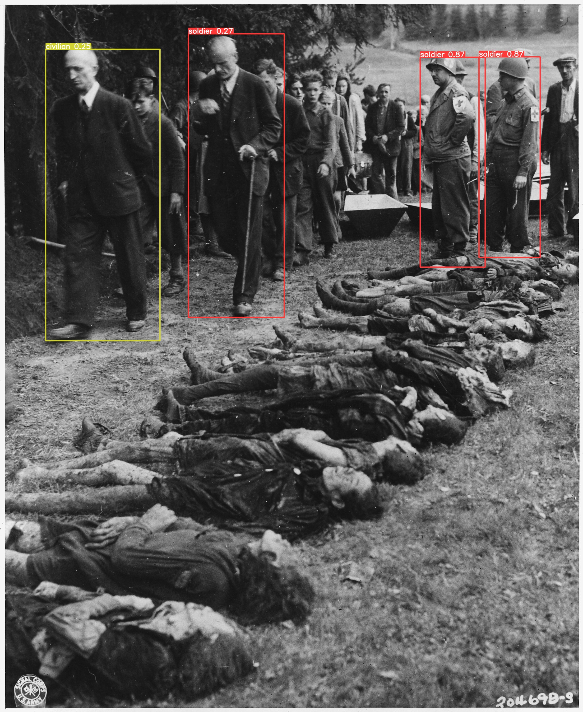
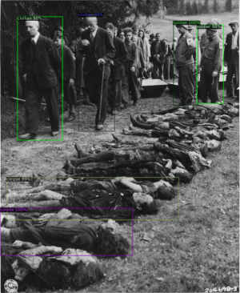
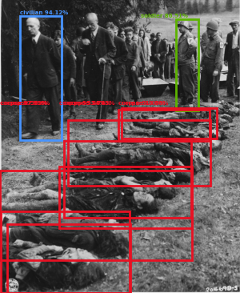

# People Detection
This repository contains the work for the lecture Scene Understanding & Surveillance (SUS) 2022.
We detect five categories of people in historical film shots by using the three following methodologies as basis:
- [YOLOv5](https://github.com/ultralytics/yolov5/blob/master/README.md)
- [Faster R-CNN](https://github.com/facebookresearch/detectron2/blob/main/README.md)
- [DETR](https://github.com/facebookresearch/detr/blob/main/README.md)

In the demo folder there are three scripts to evaluate each one of the methods individually with custom images.

<p align="center">
  
  
  
</p>

## Installation
This project was created and tested with python version 3.9.10, torch version 1.11 and cuda version 11.6.
In order to run it, first of all create a new python virtual environment by using:
```
python -m venv people-detection
source people-detection/bin/activate
```
then, to install all the required packages, run the following command:
```
pip install -r requirements.txt
```
note: when training YOLOv5 it is important to make sure to have the correct pytorch version installed, otherwise it doesn't work. You can install the version needed to train YOLOv5 by running:
```
pip install torch==1.7.1+cu101 torchvision==0.8.2+cu101 torchaudio==0.7.2 -f https://download.pytorch.org/whl/torch_stable.html
```
for all other purposes make sure to install the following pytorch version by running:
```
pip install torch torchvision torchaudio --extra-index-url https://download.pytorch.org/whl/cu113
```

## Usage
In order to test and use the three methodologies on custom data, use the scripts provided in the demo folder (note that to be able to run everything it is necessary to download the weights of the models).

### DETR
First of all download the weights of the model from [here](https://filesender.aco.net/?s=download&token=14741d52-3a31-40e3-a5b0-94a99c08b47b). The file is named checkpoint.pth, create a directory named output inside detr and move the checkpoint.pth file inside that directory. The structure should look something like this:
```
people-detection
└── people_detection
    ├── detr
        └── output
            └── checkpoint.pth
        ...
    ├── yolov5
    └── detectron2
...
```
After downloading the weights, to make predictions with the Detection Transformer use the script testdetr.py in the following way:
```
python testdetr.py --data_path ../images
```
where:
 - ```--data_path``` specifies the path to the folder of images to do predictions on
 
The model will run inference on the images one by one and plot the predictions on screen.

### YOLOv5
First of all download the weights of the model from [here](https://filesender.aco.net/?s=download&token=14741d52-3a31-40e3-a5b0-94a99c08b47b). The file is named best.pt, first create a directory named runs inside yolov5, then create a directory named train inside runs. Inside train create a folder named exp and, lastly, inside exp create a directory named weights and move the best.pt file inside the weights directory. The structure should look something like this:
```
people-detection
└── people_detection
    ├── detr
    ├── yolov5
        └── runs
            └── train
                └── exp
                    └── weights
                        └── best.pt
        ...
    └── detectron2
...
```
After downloading the weights, to make predictions with YOLOv5 use the script testyolo.py in the following way:
```
python testyolo.py --source ../images
```
where:
 - ```--source``` specifies the path to the folder of images to do predictions on

The model will do inference on the images one by one and save the results in a runs folder inside the demo folder where they will be available for visualization.

### Faster R-CNN
First of all download the weights of the model from [here](https://filesender.aco.net/?s=download&token=14741d52-3a31-40e3-a5b0-94a99c08b47b). The file is named model_final.pth, create a directory named output inside detectron2 and move the model_final.pth file inside that folder. The structure should look something like this:
```
people-detection
└── people_detection
    ├── detr
    ├── yolov5
    └── detectron2
        └── output
                └── model_final.pth
        ...
...
```
After downloading the weights, to make predictions with Faster R-CNN use the script testrcnn.py in the following way:
```
python testrcnn.py --file ../images
```
where:
 - ```--file``` specifies the path to the folder of images to do predictions on

The model will run inference on the images one by one and plot the predictions on screen.

## Training
To train the models first of all create your own dataset, split it into train, val and test and label each set separately using the [VoTT](https://github.com/microsoft/VoTT) annotation tool. When labeling, the classes must have the following ordering:
```
- 0: Soldier
- 1: Corpse
- 2: Person with KZ uniform
- 3: Crowd
- 4: Civilian
```
Once done labeling, export each VoTT project and rename the .json files generated following the listed convention:
```
- train: "SUS-train-export"
- val: "SUS-val-export"
- test: "SUS-test-export"
```

After generating and renaming the .json files, move them inside the dataset folder together with all the images. The structure of the dataset folder must be the following:
```
people-detection
└── dataset
    ├── dataset_to_coco.py
    ├── dataset_to_yolo.py
    ├── train
    ├── val
    ├── test
    ├── SUS-train-export.json
    ├── SUS-val-export.json
    └── SUS-test-export.json
...
```
where:
 - ```train``` contains all the training images
 - ```val``` contains all the validation images
 - ```test``` contains all the testing images

It is really important to folow the exact naming conventions. Additional steps are required individually per each methodology:
### DETR
In order to be able to train DETR we need to convert our labels from VoTT json format to COCO json format. In order to do so, use the script dataset_to_coco.py in the following way, once for each set of annotations:
```
python dataset_to_coco.py --file SUS-train-export.json --mode train
```
where:
 - ```--file``` specifies file to convert to coco
 - ```--mode``` specifies the set that we are converting

Running the script for all three modes (train, val, test) will generate three new files inside the dataset folder that now will look something like this:
```
people-detection
└── dataset
    ├── dataset_to_coco.py
    ├── dataset_to_yolo.py
    ├── train
    ├── val
    ├── test
    ├── SUS-train-export.json
    ├── SUS-val-export.json
    ├── SUS-test-export.json
    ├── SUS_train.json
    ├── SUS_val.json
    └── SUS_test.json
...
```
After taking care of this additional step we can train DETR with the traindetr.py script provided in the develop folder in the following way:
```
python traindetr.py --dataset_file historical --data_path ../dataset/ --output_dir output --resume ../people_detection/detr/weights/detr-r50-e632da11.pth
```
where:
 - ```--dataset_file``` specifies what dataset we are using 
 - ```--data_path``` specifies the path to the dataset
 - ```--output_dir``` specifies the directory in which to save the trained model weights
 - ```--resume``` specifies the weights from which to resume training
 - ```--epochs``` is a parameter that we can set optionally to control the number of epochs for which the model with be trained

Further parameters like learning rate can be optionally set and the results will be saved inside the output folder defined above.

### YOLOv5
In order to be able to train YOLOv5 we need to convert our labels from VoTT json format to YOLO format. First of all create a folder named yolo inside the dataset folder. Then, inside the yolo folder, create two additional folders named images and labels. Copy all the train, val and test images in their respective folders inside the images folder in the yolo directory and, lastly, create three empty directories named train, val and test inside the labels folder. The structure should look something like this:
```
people-detection
└── dataset
    ├── dataset_to_coco.py
    ├── dataset_to_yolo.py
    ├── train
    ├── val
    ├── test
    ├── SUS-train-export.json
    ├── SUS-val-export.json
    ├── SUS-test-export.json
    ├── SUS_train.json
    ├── SUS_val.json
    ├── SUS_test.json
    └── yolo
        ├── images
            ├── train
            ├── val
            └── test
        └── labels
            ├── train
            ├── val
            └── test
...
```
Once done, use the script dataset_to_yolo.py in the following way, once for each set of images:
```
python dataset_to_yolo.py --mode train
```
where:
 - ```--mode``` specifies the set that we are converting

note: when training YOLOv5 it is important to make sure to have the correct pytorch version installed, otherwise it doesn't work. You can install the version needed to train YOLOv5 by running:
```
pip install torch==1.7.1+cu101 torchvision==0.8.2+cu101 torchaudio==0.7.2 -f https://download.pytorch.org/whl/torch_stable.html
```
After taking care of these additional steps we can train YOLOv5 with the trainyolo.py script provided in the develop folder in the following way:
```
trainyolo.py --epochs 100 --workers 2
```
where:
 - ```--epochs``` specifies the total number of epochs for which the model will be trained
 - ```--workers``` specifies the amount of workers

After training, the model will be saved under runs/train/exp__/weights/best.pt (e.g. exp10, the heighest number is the most recent run).

### FasterRCNN
For Faster R-CNN no additional steps are required, simply run the script trainrcnn.py in the following way:
```
python trainrcnn.py 
```
The model will be saved under output/model_final.pth.

## Inference
The develop folder contains three additional scripts that have been used during and after the training procedure to run inference on the test images through the models and check the models' behavior. However, to do inference it is highly recommended to use the scripts present in the demo folder. Check the section [Usage](#usage) above.

## References
We build our project on the following repositories:

[DETR](https://github.com/facebookresearch/detr)
```
@inproceedings{carion2020end,
  title={End-to-end object detection with transformers},
  author={Carion, Nicolas and Massa, Francisco and Synnaeve, Gabriel and Usunier, Nicolas and Kirillov, Alexander and Zagoruyko, Sergey},
  booktitle={European conference on computer vision},
  pages={213--229},
  year={2020},
  organization={Springer}
}
```
[YOLOv5](https://github.com/ultralytics/yolov5)
```
@inproceedings{redmon2016you,
  title={You only look once: Unified, real-time object detection},
  author={Redmon, Joseph and Divvala, Santosh and Girshick, Ross and Farhadi, Ali},
  booktitle={Proceedings of the IEEE conference on computer vision and pattern recognition},
  pages={779--788},
  year={2016}
}
```
[Faster R-CNN](https://github.com/facebookresearch/detectron2)
```
@article{ren2015faster,
  title={Faster r-cnn: Towards real-time object detection with region proposal networks},
  author={Ren, Shaoqing and He, Kaiming and Girshick, Ross and Sun, Jian},
  journal={Advances in neural information processing systems},
  volume={28},
  year={2015}
}
```
